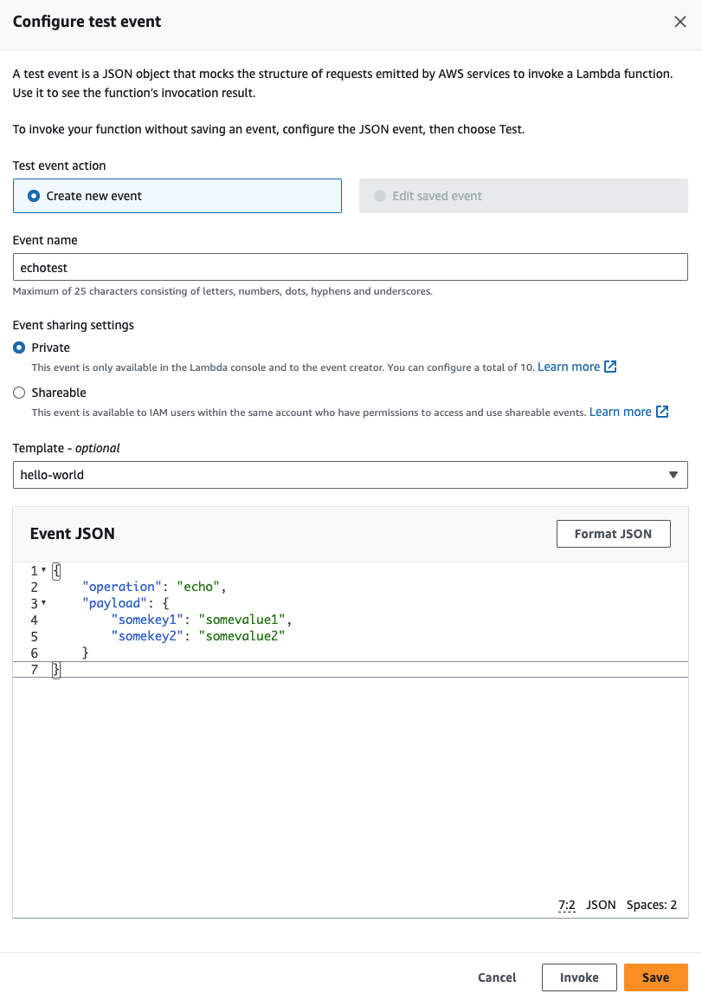
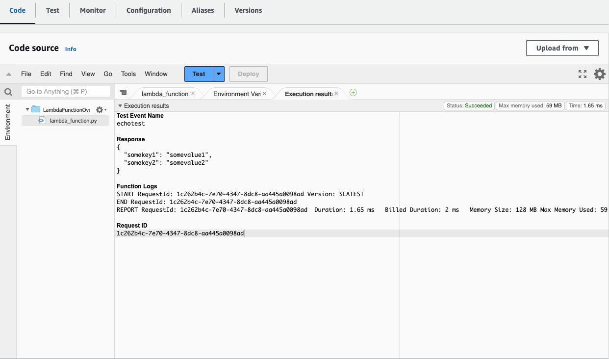
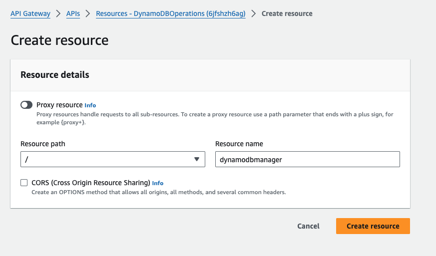
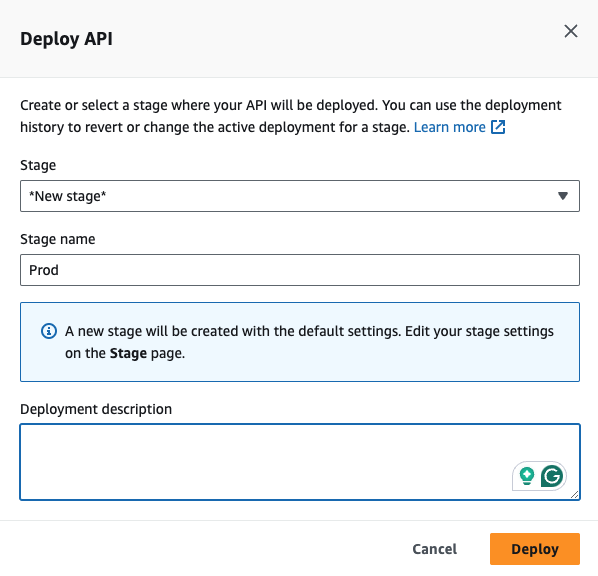

# Serverless API with AWS Lambda, DynamoDB, and API Gateway

This project demonstrates how to build a serverless API using **AWS Lambda**, **DynamoDB**, and **API Gateway**. The API supports CRUD operations on a DynamoDB table, using Lambda as the backend logic.

---

## Overview and High-Level Design

The architecture consists of the following AWS services:

1. **Amazon API Gateway**: To expose the API.
2. **AWS Lambda**: To handle business logic for DynamoDB CRUD operations.
3. **Amazon DynamoDB**: To store data.
4. **CloudWatch Logs**: For logging Lambda execution.

In this tutorial, you will:
- Create an API with one resource (`DynamoDBManager`) and one method (`POST`).
- Invoke Lambda functions via API Gateway to perform operations on DynamoDB, including create, read, update, delete, and list items.

---

## Features

- **CRUD Operations** on DynamoDB via API Gateway:
  - Create, update, delete, read, and list items in a DynamoDB table.
- **Postman & Curl Support**: Use Postman or Curl to interact with the API.
- **Serverless**: Built entirely using AWS serverless components.

---

## Setup

### Step 1: Create a Lambda IAM Role

Before assigning permissions, you need to create a role for the Lambda function. This role will allow the Lambda function to interact with **DynamoDB** and **CloudWatch Logs**. We will split the permissions into two policies:

1. **Custom DynamoDB Policy**: Granting specific CRUD access to the DynamoDB table.
2. **AWS Managed CloudWatch Logs Policy**: Use the AWS-managed policy `AWSLambdaBasicExecutionRole` for logging permissions.

#### Step 1.1: Open the IAM Console and Create a Role

1. Open the **IAM Console**.
2. Select **Roles**.
3. Click on the **Create Role** button.
4. For **Trusted entity type**, choose **AWS service** and then select **Lambda** as the use case (since this role is for a Lambda function).
5. Click **Next: Permissions**.

#### Step 1.2: Attach AWS Managed CloudWatch Logs Policy

For logging permissions, we will use the AWS-managed policy **`AWSLambdaBasicExecutionRole`**, which provides the necessary permissions for **CloudWatch Logs** without needing to define a custom policy.

1. In the search bar, type **`AWSLambdaBasicExecutionRole`** and select the managed policy from the list.
2. Click **Next**.
3. In the **Role name** field, provide a meaningful name for the role, for example: **`lambda-dynamodb-execution-role`**.
4. Click **Create role**.

This AWS-managed policy allows Lambda to:
- **Create log groups**.
- **Create log streams**.
- **Put log events** (i.e., write logs to CloudWatch).

#### Step 1.3: Create a Custom DynamoDB Policy

1. After the role is created, navigate to the role you just created.
2. Click **Add permissions**, then select **Create inline policy**.
3. In the policy editor, switch to the **JSON** tab and paste the following JSON policy:

    ```json
    {
      "Version": "2012-10-17",
      "Statement": [
        {
          "Sid": "DynamoDBAccess",
          "Effect": "Allow",
          "Action": [
            "dynamodb:PutItem",
            "dynamodb:GetItem",
            "dynamodb:UpdateItem",
            "dynamodb:DeleteItem",
            "dynamodb:Scan"
          ],
          "Resource": "*"
        }
      ]
    }
    ```

4. Click **Next**.
5. Provide a meaningful name for the policy (e.g., **`LambdaDynamoDBCRUDPolicy`**).
6. Click **Create policy**.

This custom policy grants your Lambda function CRUD access to your DynamoDB table.

> **Disclaimer: Why `*` in Resource:**
>
> At this point, we haven’t created the DynamoDB table yet, so we don't have the specific Amazon Resource Name (ARN). For now, we'll allow access to all DynamoDB tables using `*`. Once the DynamoDB table is created, we will update this policy to target the exact ARN of the specific table.

### Step 2: Create the Lambda Function

1. In the AWS Lambda Console, create a new function:
   - **Name**: `LambdaFunctionOverHttps`
   - **Runtime**: Python 3.12
   - **Permissions**: Attach the `lambda-dynamodb-execution-role` created earlier.


2. Click **Create function**

3. Replace the default code with the following:

    ```python
    import boto3
    import json

    def lambda_handler(event, context):
        operation = event['operation']
        
        if 'tableName' in event:
            dynamo = boto3.resource('dynamodb').Table(event['tableName'])
        
        operations = {
            'create': lambda x: dynamo.put_item(**x),
            'read': lambda x: dynamo.get_item(**x),
            'update': lambda x: dynamo.update_item(**x),
            'delete': lambda x: dynamo.delete_item(**x),
            'list': lambda x: dynamo.scan(**x),
            'echo': lambda x: x,
            'ping': lambda x: 'pong'
        }
        
        if operation in operations:
            return operations[operation](event.get('payload'))
        else:
            raise ValueError(f'Unrecognized operation "{operation}"')
    ```


4. Click **Deploy**

### Step 3: Test the Lambda Function

Let's test the Lambda function by performing an echo operation before we connect it to DynamoDB.

1. In the Lambda Console, configure a test event by clicking the **Test** button.
2. In the **Configure test event** window, select **Create new event**.
3. For the Event name, enter a name such as **`echotest`**.
4. In the **Event JSON** section, paste the following JSON:

    ```json
    {
        "operation": "echo",
        "payload": {
            "somekey1": "somevalue1",
            "somekey2": "somevalue2"
        }
    }
    ```


6. Click **Save**.
7. After running the test, you should see the output in the console.



This test confirms that the Lambda function is working properly by echoing the payload you send it.

---

## Create DynamoDB Table

Next, create the DynamoDB table that will be used by the Lambda function:

1. Go to the **DynamoDB Console**.
2. Choose **Create table**.
3. Set the following parameters:
   - **Table name**: `lambda-apigateway`
   - **Primary key**: `id` (string)
4. Click **Create**.


---

## Create the API in API Gateway

1. Go to the **API Gateway Console**.
2. Click **Create API**.
3. Select **REST API**, then click **Build**.
4. Name the API **DynamoDBOperations**, and click **Create API**.


### Create API Resources

1. Click **Create Resource**.
2. Set **Resource Name** to `dynamodbmanager`, and click **Create Resource**.



### Create POST Method for API

1. With the `/dynamodbmanager` resource selected, click **Actions** > **Create Method**.
2. Select **POST** from the dropdown, then select the **LambdaFunctionOverHttps** Lambda function.
3. Save the integration and allow API Gateway to invoke the Lambda function.


---

## Deploy the API

1. In **API Gateway**, click **Actions** > **Deploy API**.
2. Create a new stage called `Prod`, and click **Deploy**.



---

## Running the Solution

You can now use Postman or Curl to interact with your API and DynamoDB.

### Example Request - Create Item (Curl)

```bash
curl -X POST -d "{\"operation\":\"create\",\"tableName\":\"lambda-apigateway\",\"payload\":{\"Item\":{\"id\":\"1\",\"name\":\"Bob\"}}}" https://<API_ID>.execute-api.<REGION>.amazonaws.com/prod/DynamoDBManager
